# Математическая спецификация рейтинговой системы

## 1. Обозначения и константы

| Символ                 | Описание                                                                                          |
| ---------------------- | ------------------------------------------------------------------------------------------------- |
| $R$                    | Открытый рейтинг игрока (видимый)                                                                 |
| $R_{\min},\; R_{\max}$ | Границы открытого рейтинга                                                                        |
| $\Delta_\text{open}$   | $R_{\max} - R_{\min}$ — полный диапазон открытого рейтинга                                        |
| $\mu,\; \sigma$        | Параметры скрытого байесовского рейтинга (мат ожидание, отклонение)                               |
| $\sigma_\text{init}$   | Начальная неопределенность оценки                                                                 |
| $o(\mu, \sigma)$       | Ординал скрытого рейтинга: $o(\mu, \sigma) = \dfrac{\mu}{1 + g\frac{\sigma}{\sigma_\text{init}}}$ |
| $\sigma(x)$            | Стандартная логистическая сигмоида: $\sigma(x) = \dfrac{1}{1 + e^{-x}}$                           |
| $s_\text{closed}$      | Параметр масштаба сигмоиды отображения ($s_\text{closed} = 10$ экспериментально)                  |
| $d$                    | Параметр крутизны гейт-функции коррекции ($d = 4$ экспериментально)                               |
| $g$                    | Гравитация оценки игрока ($g = 0.5$ экспериментально)                                             |
| $R_\text{avg}$         | Мат. ожидание открытой системы (Для overwatch $R_\text{avg}=2400$)                                |

### 1.1 Гиперпараметры

| Параметр               | Описание                                             | Доступна пользователю? |
| ---------------------- | ---------------------------------------------------- | :--------------------: |
| $R_{\min},\; R_{\max}$ | Границы открытого рейтинга                           |           Да           |
| $g$                    | Гравитация оценки игрока                             |           Да           |
| $R_\text{avg}$         | Мат. ожидание распределения игроков открытой системы |           Да           |
| $d$                    | Крутизна гейт-функции                                |          Нет           |
| $\sigma_{\text{init}}$ | Начальная неопределённость нового игрока             |          Нет           |

---

## 2. Отображение рейтинговых систем

### 2.1 Поправка на центр открытой системы

$$
\Delta_{translate} = \frac{R_\text{min}+R_\text{max}}{2} - R_\text{avg} 
$$

### 2.2 Масштаб транслирования

$$
s_\text{closed} = 4\sigma_\text{init}
$$

### 2.3. Прямое отображение: из скрытой в открытую

Отображение неограниченного ординала $o \in (-\infty, +\infty)$ в ограниченное пространство открытого рейтинга $[R_{\min},\; R_{\max}]$:

На базе функции сигмойда

$$
f(o) = R_{\min} + \Delta_\text{open} \cdot \sigma_{\text{sig}}\!\left(\frac{o}{s_\text{closed}}\right) - \Delta_{translate}
$$

### 2.4. Обратное отображение: из открытой в скрытую

На базе функции логит

$$
f^{-1}(R) = s_\text{closed} \cdot \ln\!\left(\frac{(R+\Delta_{translate}) - R_{\min}}{R_{\max} - (R+\Delta_{translate})}\right)
$$

---

## 3. Скрытый рейтинг (байесовская модель)

### 3.1. Модель

Используется `ThurstoneMostellerFull` из пакета OpenSkill. Каждый игрок характеризуется парой $(\mu, \sigma)$.

После каждого матча параметры обновляются на основе результата полного попарного сравнения всех игроков в командах.

### 3.2. Ординал

$$
o(\mu, \sigma) = \dfrac{\mu}{1 + g\frac{\sigma}{\sigma_\text{init}}}
$$

### 3.3. Визуализация ординала

При $g=0.6$, оси: $x=\sigma; y=\mu$

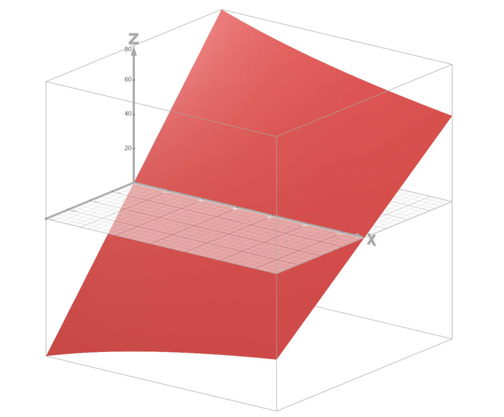

Вид сбоку

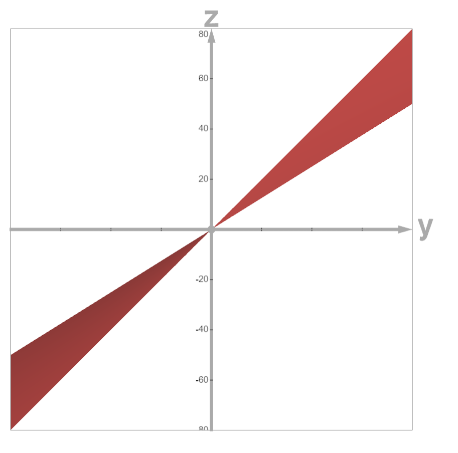

При $g=3$, оси: $x=\sigma; y=\mu$

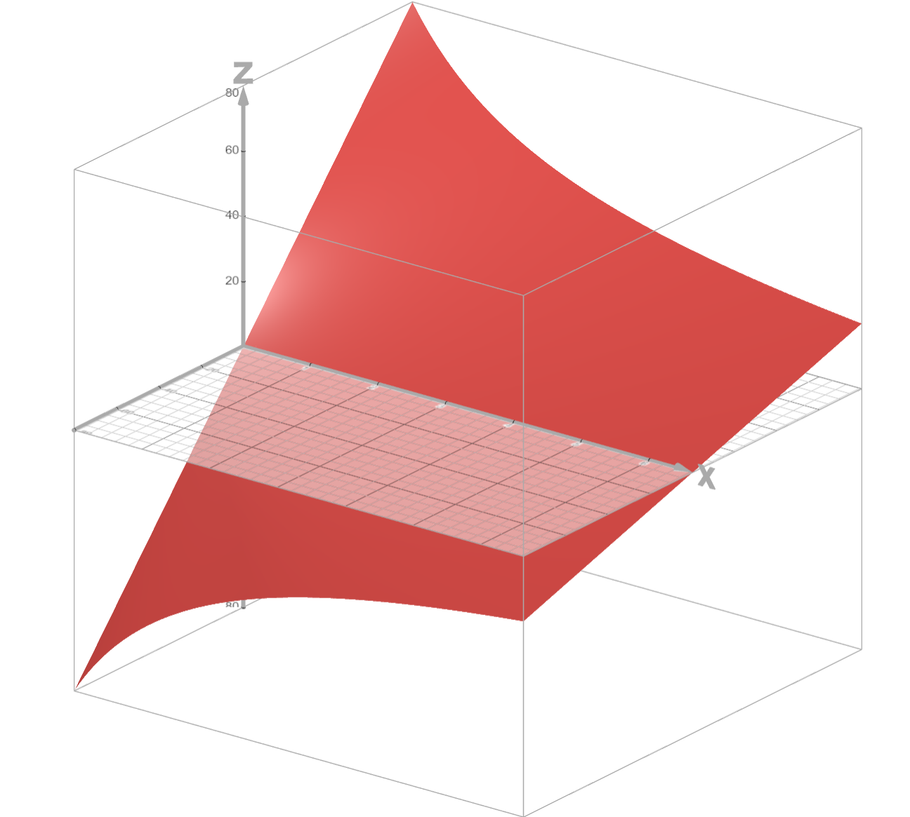

Вид сбоку

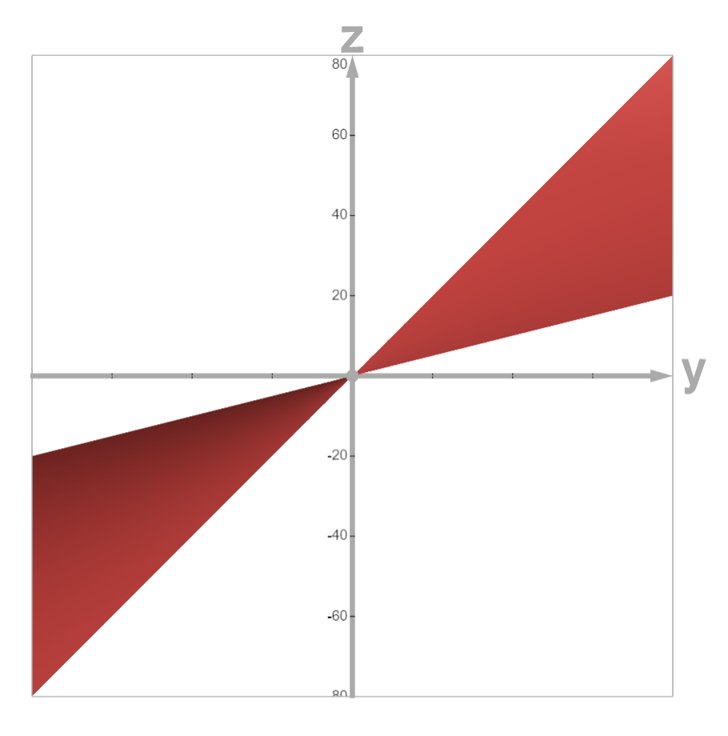

Для сравнения, ординал из документации openskill $o(\mu, \sigma) = \mu - 3\sigma$

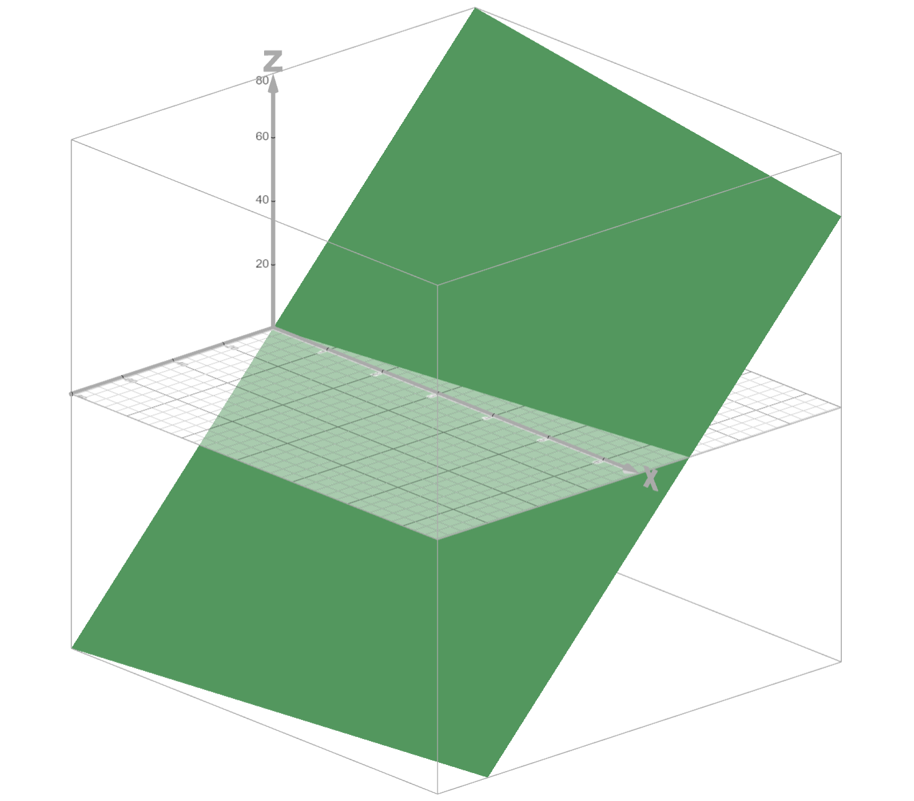

Вид сбоку

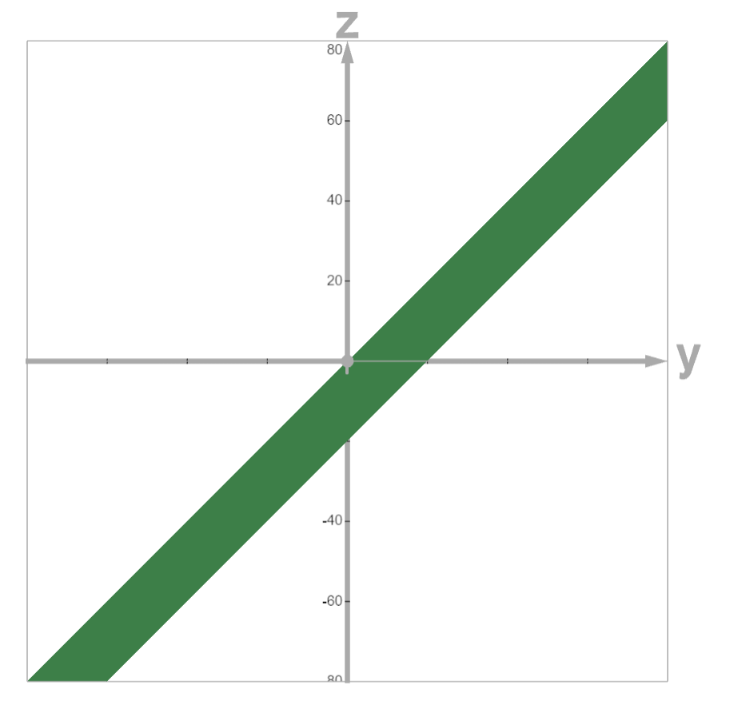

---

## 4. Инициализация нового игрока

При первой экспертной оценке $R_{\text{expert}}$:

1. Установить открытый рейтинг:
$$
R = R_{\text{expert}}
$$

2. Установить начальное $\mu$ скрытого рейтинга напрямую из экспертной оценки:
$$
\mu_{\text{init}} = f^{-1}(R_{\text{expert}})
$$

3. Установить начальную неопределённость:
$$
\sigma_{\text{init}} — \text{гиперпараметр системы}
$$

---

## 5. Гейт-функция коррекции

Центральный элемент системы — функция, управляющая силой коррекции в зависимости от расхождения между открытым и скрытым рейтингами.

### 5.1. Определение

$$
G(\Delta) = \sigma_{\text{sig}}\!\left(\frac{2d \cdot |\Delta|}{\Delta_\text{open}} - d\right)
$$

где $\Delta$ — разность между проекцией скрытого рейтинга и открытым рейтингом (определена ниже).

### 5.2. Свойства

| $\lvert\Delta\rvert / \Delta_\text{open}$ | $G(\Delta)$ при $d=6$ | Интерпретация          |
| :---------------------------------------: | :-------------------: | :--------------------- |
|                    $0$                    |  $\approx 0{,}0025$   | Нет коррекции          |
|                 $0{,}25$                  |   $\approx 0{,}047$   | Слабая коррекция       |
|                  $0{,}5$                  |        $0{,}5$        | Средняя коррекция      |
|                 $0{,}75$                  |   $\approx 0{,}953$   | Сильная коррекция      |
|                  $1{,}0$                  |  $\approx 0{,}9975$   | Почти полная коррекция |

**Смысл**: малые расхождения между экспертной и статистической оценкой игнорируются; значительные — приводят к всё более полной коррекции.

### 5.3 График

При $d=4$, $\Delta_\text{open}=5000$

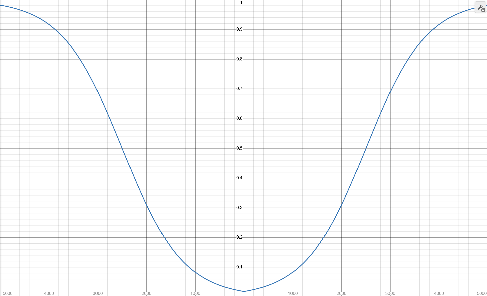

При $d=6$, $\Delta_\text{open}=5000$

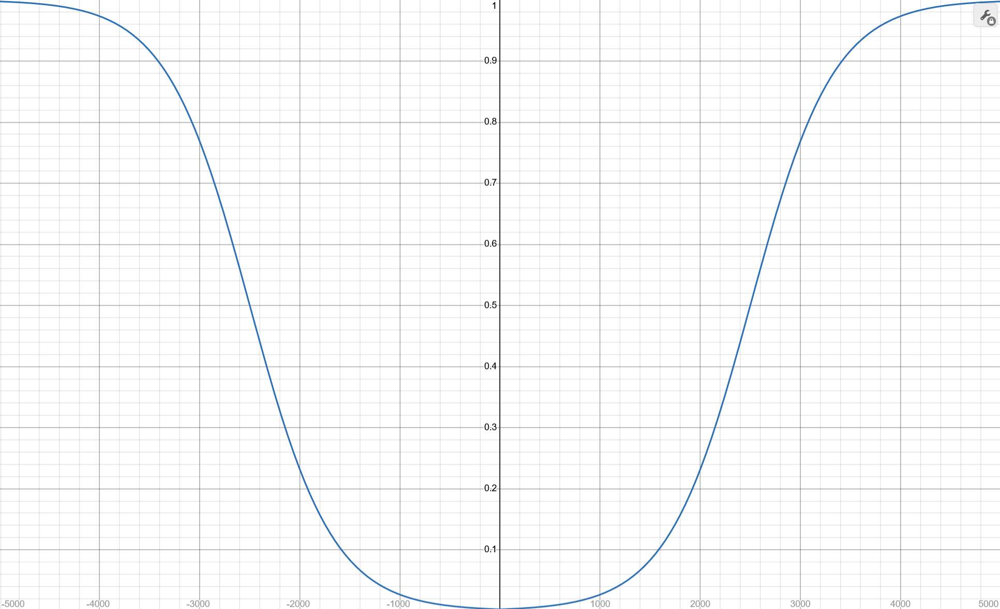

При $d=8$, $\Delta_\text{open}=5000$

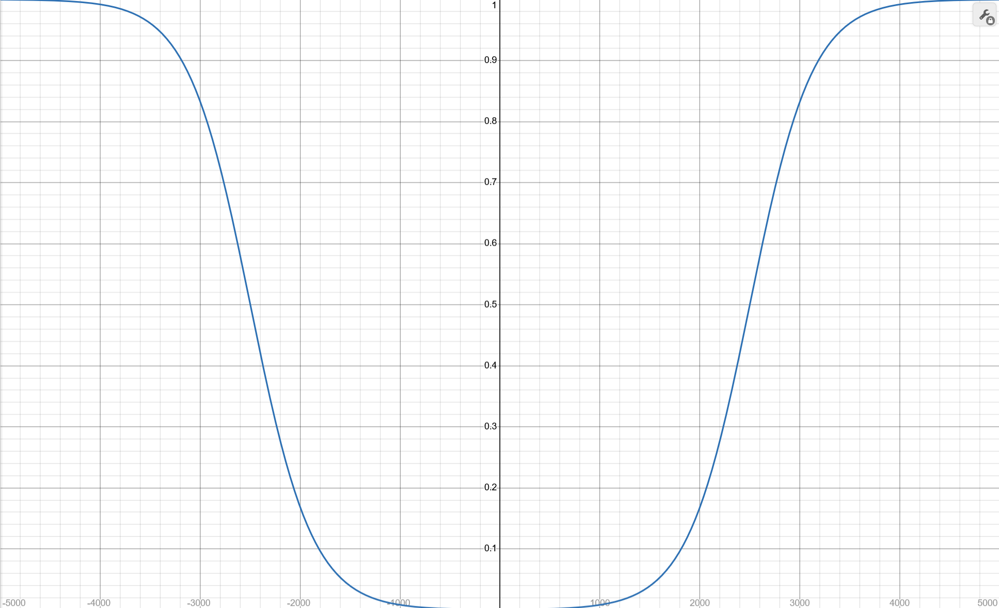

С ростом коэффициента $d$ увеличивается категоричность системы. 

---

## 6. Эффективный рейтинг для матчмейкинга (снапшот)

При формировании команд вычисляется **эффективный рейтинг**, оценка из открытой системы, скорректированная оценкой закрытой системы.

### 6.1. Вычисление разности

$$
\Delta = f(o) - R
$$

- $\Delta > 0$: скрытый рейтинг выше открытого (игрок недооценён экспертом)
- $\Delta < 0$: скрытый рейтинг ниже открытого (игрок переоценён экспертом)

### 6.2. Поправка

$$
\Delta_{\text{eff}} = G(\Delta) \cdot \Delta
$$

### 6.3. Эффективный рейтинг

$$
R_{\text{eff}} = \text{clamp}\!\Big(R + \Delta_{\text{eff}},\; R_{\min},\; R_{\max}\Big)
$$

---

## 7. Обновление рейтингов после матча (ранкер)

### 7.1. Порядок операций

1. Зафиксировать состояние **до** матча: $o_{\text{old}},\; R_{\text{old}}$
2. Получить результат матча
3. Обновить скрытый рейтинг через `ThurstoneMostellerFull`: $(\mu, \sigma) \to (\mu', \sigma')$
4. Вычислить новый ординал: $o_{\text{new}} = \dfrac{\mu'}{1 + g\frac{\sigma'}{\sigma_\text{init}}}$
5. Обновить открытый рейтинг

### 7.2. Обновление скрытого рейтинга

Выполняется стандартным образом через `ThurstoneMostellerFull` из пакета OpenSkill. На вход подаются команды с текущими $(\mu, \sigma)$ и порядок финиша (ранк). На выходе — обновлённые $(\mu', \sigma')$ для каждого игрока.

### 7.3. Обновление открытого рейтинга

Изменение открытого рейтинга складывается из двух компонент:

#### Компонента 1: коррекция к скрытому (притяжение)

$$
\Delta_{\text{old}} = f(o_{\text{old}}) - R_{\text{old}}
$$

#### Компонента 2: импульс от результата матча

$$
\Delta_{\text{match}} = f(o_{\text{new}}) - f(o_{\text{old}})
$$

#### Итоговое обновление

$$
R_{\text{new}} = R_\text{old} + 2 \cdot \Delta_{\text{match}} \cdot \sigma_{\text{sig}}(\frac{2 \cdot \Delta_{\text{old}} \cdot \text{sign}(\Delta_{\text{match}})}{\Delta_\text{open}})
$$

### 7.4 Доказательство сходимости

Открытый рейтинг игрока в момент времени $t$ можно представить как отображенный ординал скрытого рейтинга и расхождение с ним

$$
R_t = f(o_t) + \Delta_t
$$

Соответственно когда мы применяем нашу формулу, первая составляющая изменяется на $\Delta_\text{match}$, а вторая составляющая на какую-то величину $\Delta_\text{diff}=2 \cdot \Delta_{\text{match}} \cdot \sigma_{\text{sig}}(\frac{2 \cdot \Delta_{\text{old}} \cdot \text{sign}(\Delta_{\text{match}})}{\Delta_\text{open}}) - \Delta_\text{match}$.

Очевидно, чтобы система точно сходилась к скрытому рейтингу должно выполнятся условие $|\Delta_\text{old}| \ge |\Delta_\text{old} - \Delta_\text{diff}|$ или же $|\Delta_\text{old}| - |\Delta_\text{old} -\Delta_\text{diff}| \ge 0$

Для проверки этого сделаем визуализацию $|\Delta_\text{old}| - |\Delta_\text{old} -\Delta_\text{diff}|$ от $\Delta_\text{match}$ и $\Delta_\text{old}$

Графики при $\Delta_\text{open}=5000$

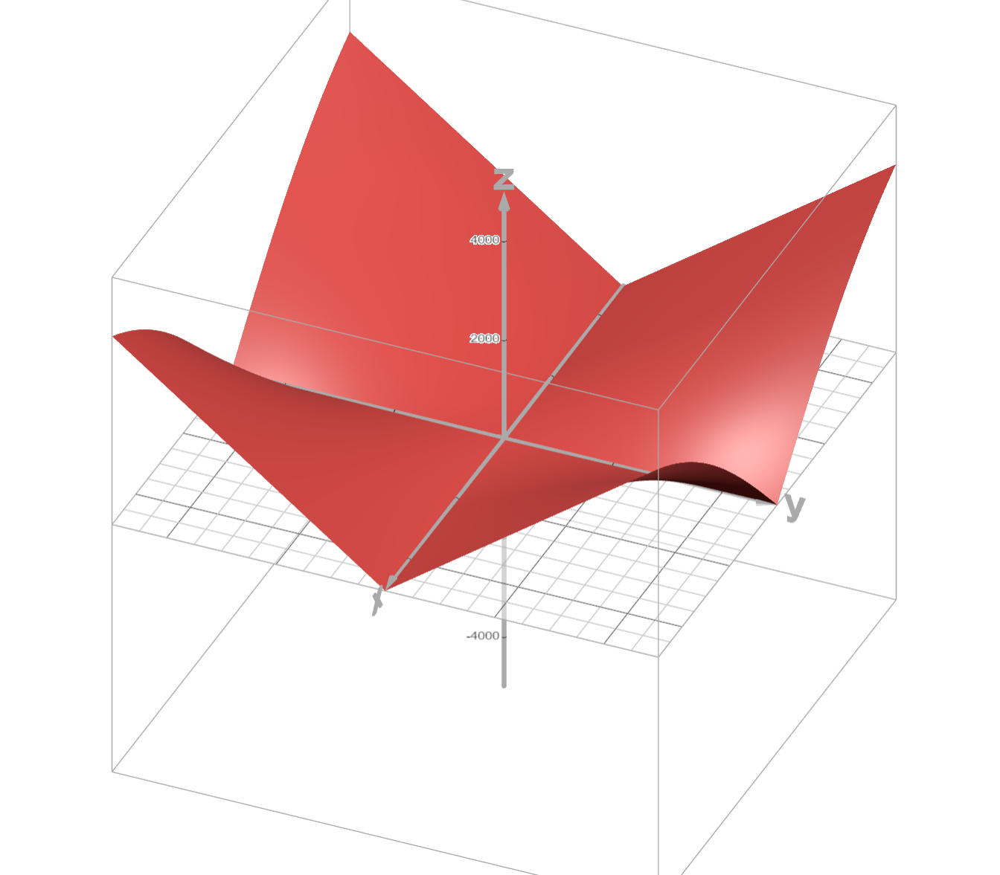

Вид сбоку

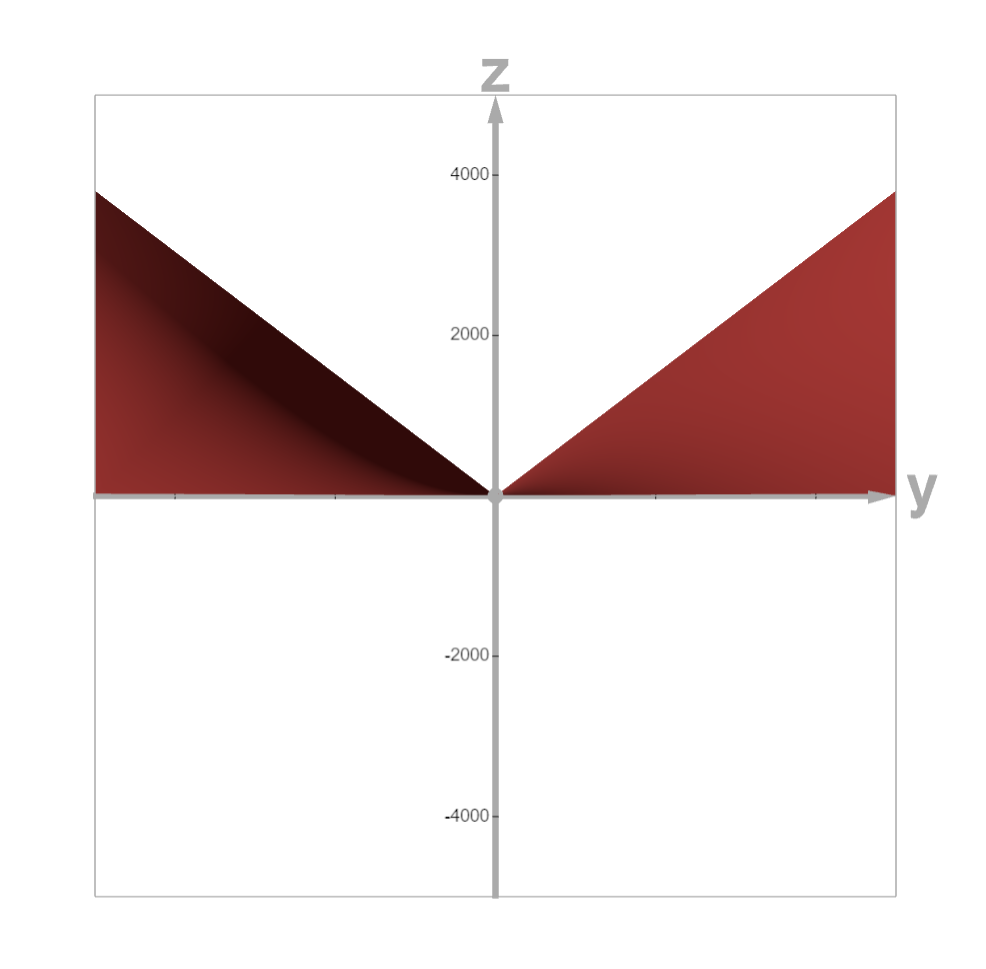

На визуализации видно, что весь график лежит в верхнем полупространстве, значит условие выполняется.

Также в наблюдаемой зоне (От $-\Delta_\text{open}$ до $\Delta_\text{open}$) форма графика не зависит от $\Delta_\text{open}$. График при $\Delta_\text{open}=110$

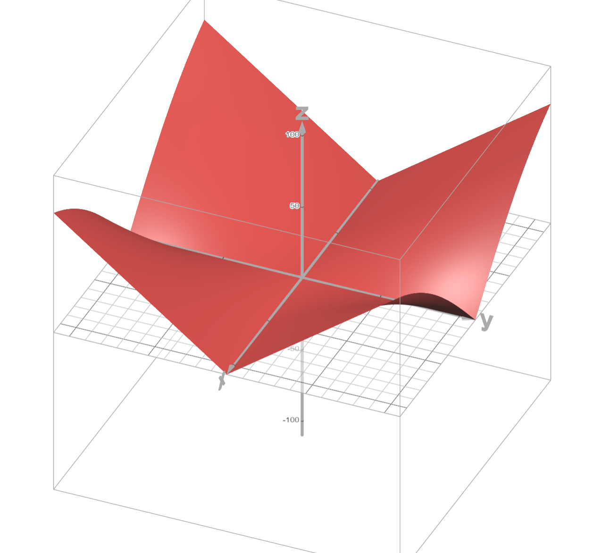

Вид сбоку

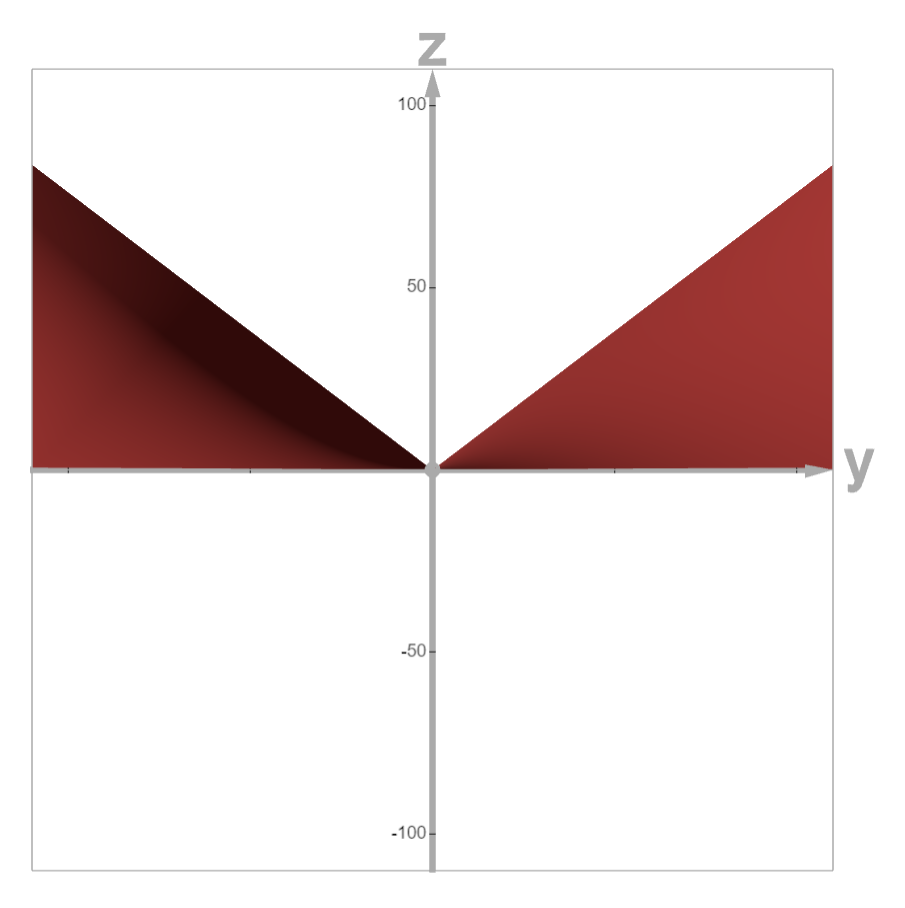

---

## 8. Экспертная коррекция открытого рейтинга

Проводящий игры может в любой момент задать новое значение $R$ напрямую. Скрытый рейтинг при этом **не изменяется**. Расхождение будет автоматически учтено через эффективный рейтинг при следующем матчмейкинге.
